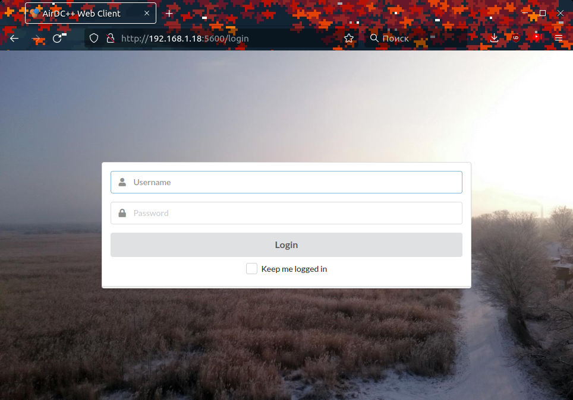
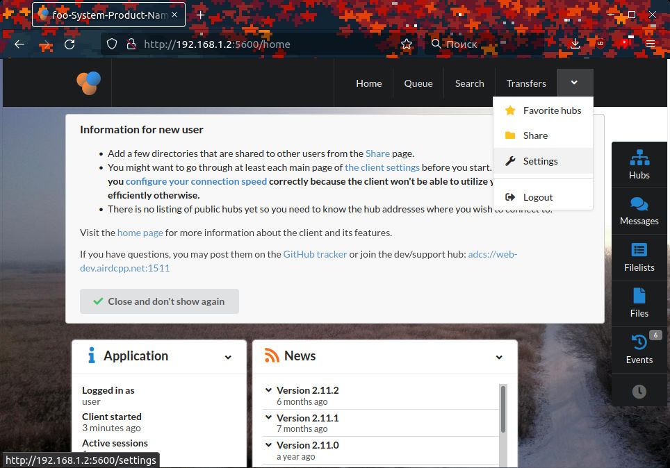
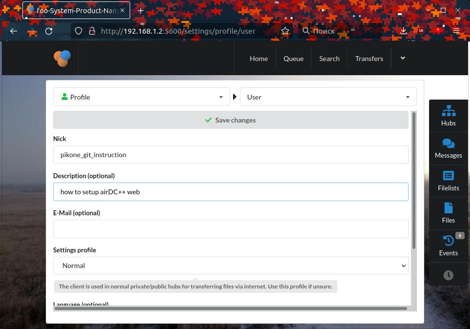
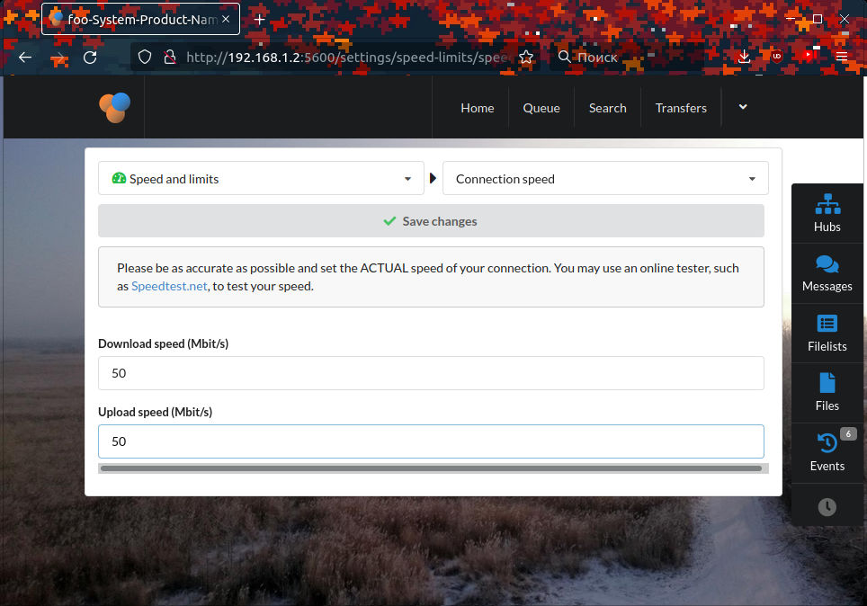
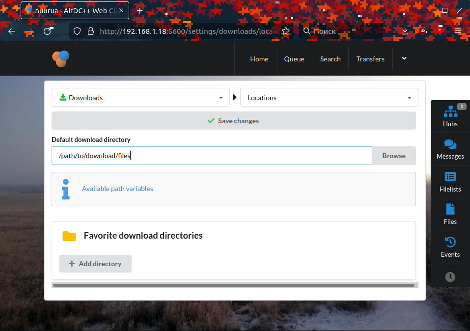
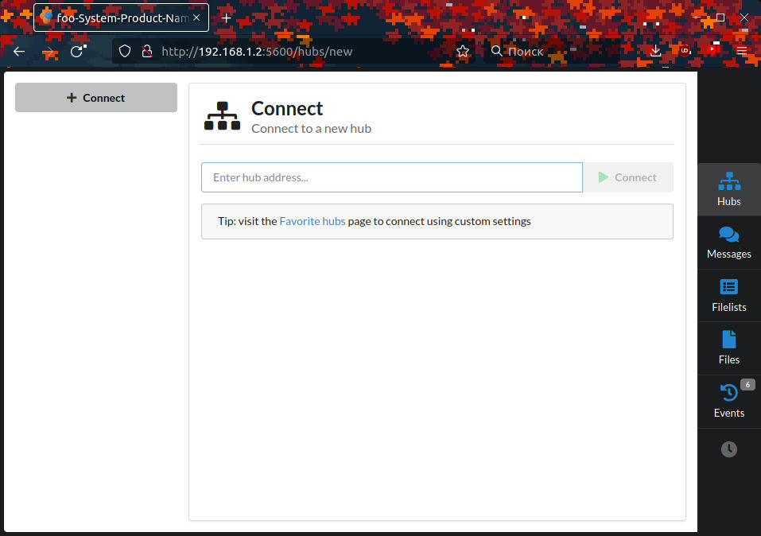
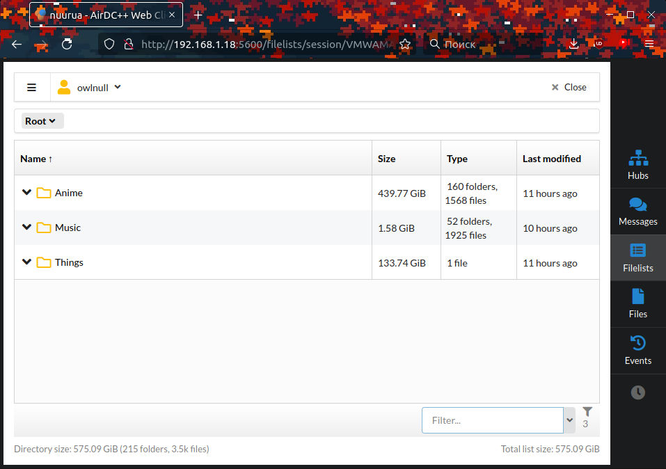

# DC++

DC++ - Файлообменная, частично централизованная, P2P сеть. Частично, потому что для своей работы требует hub с белым IP адресом.

Клиенты:
- [AirDC++](https://www.airdcpp.net/)
- [EiskaltDC++](https://github.com/eiskaltdcpp/eiskaltdcpp)
- [microdc2](https://github.com/jnwatts/microdc2)
- [ncdс](https://dev.yorhel.nl/ncdc)

### AirDC++ Web (Linux)

Web клиент для работы с Direct Connect

Программу можно скачать с оффициального [сайта](https://airdcpp-web.github.io/docs/installation/installation.html)

На Linux AirDC++ управляется с помощью Web интерфейса, что позволяет запускать его на серверах без графики. 

Загрузив архив его можно разархивировать с помощью tar:

```sh
tar -xfv airdcpp_2.11.2_webui-2.11.2_64-bit_portable.tar.gz ~/
```

Далее переходим в каталог `airdcpp` и запускаем конфигурацию `airdcppd`

```sh
~/airdcppd --configure
```
Cледуем инструкциям. Порт можно оставить по умолчанию. Пользователь и пароль вводятся для доступа к Web интерфейсу

По завершению конфигурации можно запустить сервер

```sh
./airdcppd
```
После запуска можно переходить в браузер, указав в адресную строку `http://<IP>:<PORT>` для дальнейшей настройки клиента. Если вы настраивали на своей машине и не меняли порт, то адрес будет `http://localhost:5600`



Вводим данные, которые указывали при конфигурации

Для правильной раздачи и подключения к hub'ам необходимо немного настроить клиент

1. Переходим в настройки клиента



2. В полях устанавливаем имя, по желанию прописываем Description
   


> Важно не забыть сохранить настройки вверху страницы

3. Настроить скорость соединения. По умолчанию она равна 0.1 Mbit/s, поэтому нужно выставить значения, которые сможет "понятнуть" ваша сеть.



4. Нужно обязательно помнить, что файлы будут загружаться туда, где установлен airDC++, а не в браузер. Поэтому нужно настроить каталог загрузки файлов.



Теперь можно приступить к использованию airdc++. Для этого нам нужно добавить hub. Для управления hab'ами, с правой стороны, есть кнопка Hubs. 



После ввода IP адреса у нас появится чат hub'а. 


Для просмотра списка участников достаточно справа внизу включить переключатель `User List`. После этого появится список всех пользователей. Уже конкретно у них можно смотреть файлы, которые они раздают




__ОБЯЗАТЕЛЬНО ПРОВЕРЯЙТЕ СКАЧАННЫЕ ФАЙЛЫ__

Сканируйте их антивирусами ([ClamAV](https://github.com/Cisco-Talos/clamav)), качайте только от тех людей, которым лично __ВЫ__ доверяете!

### Раздача файлов 

Для раздачи своих файлов нужно:

1. Перейти во вкладку `Share`


2. Слева внизу `Actions` -> `Add directory`


3. Указать путь до файлов и задать виртуальное название, которое будут видеть участники 


После добавления файла он будет доступен всем участникам в hub'е

## Будьте внимательны

При раздаче файлов учасникам hub'а ваш IP адрес виден всем, что может быть не безопасным. Поэтому закрывайте порты и __БУДЬТЕ БДИТЕЛЬНЫ И ОСТОРОЖНЫ!__  
__ОБЯЗАТЕЛЬНО СМОТРИТЕ, ЧТО ВЫ СКАЧИВАЕТЕ И ЧТО ЗАПУСКАЕТЕ__. Рекомендуется любые файлы проверять как минимум через [ClamAV](https://github.com/Cisco-Talos/clamav).